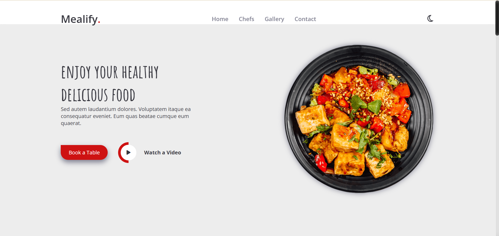

# Mealify
# Mealify 🍽️

Welcome to **Mealify**, a modern and responsive website for exploring and ordering delicious meals online. This project is designed to provide a seamless user experience for food lovers.
This project is part of my current course at **Route Academy**. In this assignment, I built a simple yet elegant webpage using **HTML** and **CSS**. Below is a breakdown of the sections included in this project:
 
 

## Features ✨
- **Home Section**: A welcoming intro with a hero section.
- **Menu**: Browse a variety of meals with images and descriptions.
- **About Us**: Learn more about Mealify and our mission.
- **Services**: Explore our delivery and catering options.
- **Contact**: Easy way to get in touch with us.

---

## Technologies Used 💻
- **HTML**: For structuring the website.
- **CSS**: For styling and responsiveness.
- **JavaScript**: For interactive elements (if applicable).
